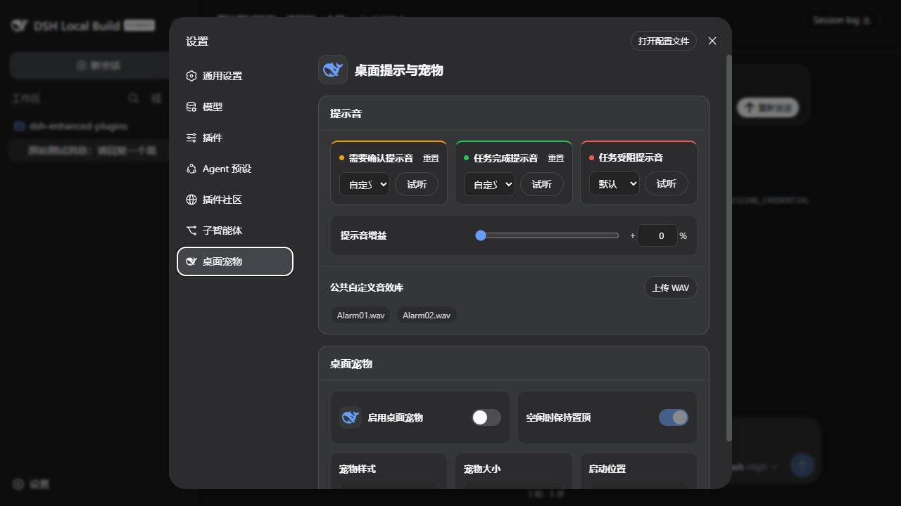
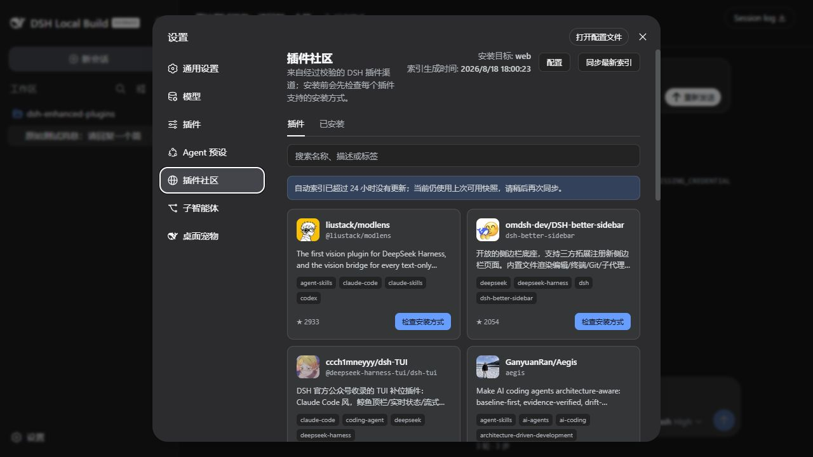
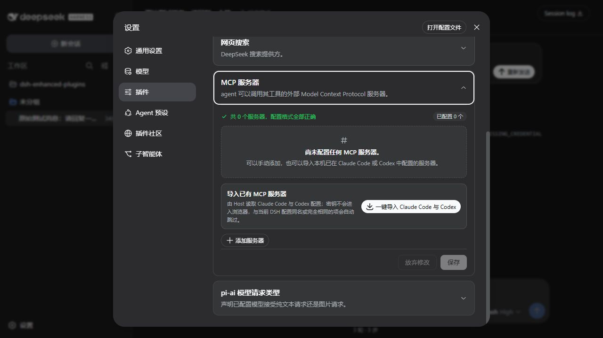
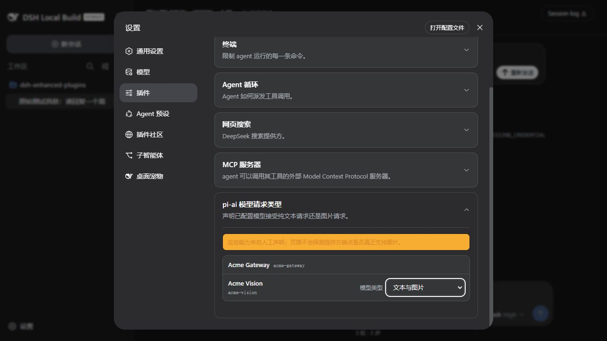
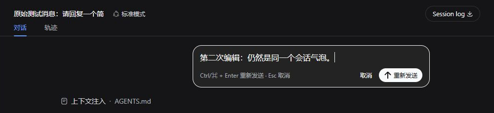
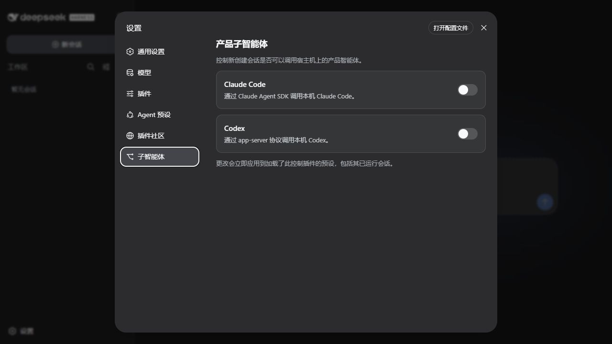

# dsh-enhanced-plugins

English | [中文](README.zh.md)

`dsh-enhanced-plugins` is a collection of enhancements for [DeepSeek Harness (DSH)](https://github.com/deepseek-ai/deepseek-harness). Install all seven features together, or keep only the independent bundles and Windows companion you need.

The project does not modify DSH core. Web features use only public plugin extension points; Windows Launcher is an installer-managed desktop companion outside the Cordis tree. Every feature can be built, installed, and removed independently.

[Feature overview](#feature-overview) · [Quick install](#quick-install) · [Feature guide](#feature-guide) · [Configuration reference](#configuration-reference) · [Development](#development-and-verification)

## Feature overview

The “install name” is the value accepted by the installer’s `-Features` parameter and is the only identifier needed for a selective install.

| Feature | Install name | Where to find it | What it adds |
| --- | --- | --- | --- |
| [Windows Launcher](#windows-launcher) | `windows-launcher` | Start menu → DeepSeek Harness Launcher | Tray, Web lifecycle, Headless, Profile, log, and diagnostic control center |
| [Desktop alerts & pet](#desktop-alerts--pet) | `notification` | Settings → Desktop Pet | Event sounds, a custom WAV library, and a native animated DeepSeek fish pet |
| [Plugin Community](#plugin-community) | `plugin-market` | Settings → Plugin Community | Search, install, and remove community DSH plugins |
| [MCP server manager](#mcp-server-manager) | `mcp-server-manager` | Settings → Plugins → Plugin configuration | Manage stdio / Streamable HTTP servers and import local configurations |
| [pi-ai model request types](#pi-ai-model-request-types) | `model-input-types` | Settings → Plugins → Plugin configuration | Declare whether each model accepts text-only or image requests |
| [Edit last message](#edit-last-message) | `edit-last-message` | Latest user-message bubble | Edit that turn and regenerate within the current session |
| [Product subagents](#product-subagents) | `sub-agent` | Settings → Subagents | Enable or disable Claude Code / Codex tools live |

> [!NOTE]
> Workspace file references are no longer an enhanced-plugin feature. The latest official DSH provides [`@` file references](https://github.com/deepseek-ai/deepseek-harness/tree/master/packages/context/file-reference): type `@` (or `@"` for a quoted path) in the conversation input and choose a workspace path. The former `referenced-file` install name and its `#` snapshot syntax are retired. They are absent from the aggregate bundle, `-Features referenced-file` is rejected, and a normal installer run removes historical standalone packages or the contribution carried by an older aggregate install.

## Quick install

### Before you start

- Node.js 22.19 or later.
- A current DSH Web profile. This repository is verified against DSH `0.1.1-rc.2`; its local baseline commit is `b150a551b8d465e31e418e1b2eaf5e79bbb7d28e`.
- Windows Launcher, native sounds, and the desktop pet require Windows 10 or later and Windows PowerShell 5.1. The other features are cross-platform.

DSH is still a developer preview and may introduce compatibility-breaking changes. If an upgrade breaks the plugin, compare its ABI with the baseline above first.

> [!CAUTION]
> **Check the DSH/plugin repository layout before copying an install command:**
>
> - **Sibling-directory install:** both repositories share the **same parent directory**; use the commands below as written.
> - **Different-directory install:** the repositories have **different parent directories**; add `-DshCheckout "absolute path to the DSH source"` to the command.

### Install every feature

**Sibling-directory install:** when `deepseek-harness` and this repository share a parent directory, run the installer from this repository root:

```text
<workspace>/
├── deepseek-harness/
└── dsh-enhanced-plugins/
```

```powershell
powershell.exe -NoProfile -ExecutionPolicy Bypass -File .\scripts\migrate-to-enhanced-plugin.ps1
```

Omitting `-Features` or passing `-Features all` installs six Cordis enhancements plus the standalone Windows Launcher companion. It does not install the retired file-reference plugin. Launcher files go to `%LOCALAPPDATA%\DeepSeekHarness\Launcher`, with a Start-menu shortcut; pass `-CreateLauncherDesktopShortcut` to add a desktop shortcut too.

### Install selected features

List the features provided by the current checkout:

```powershell
powershell.exe -NoProfile -ExecutionPolicy Bypass -File .\scripts\migrate-to-enhanced-plugin.ps1 -ListFeatures
```

Then pass comma-separated install names from the feature overview. For example, keep only desktop alerts, MCP management, and editing the last message:

```powershell
powershell.exe -NoProfile -ExecutionPolicy Bypass -File .\scripts\migrate-to-enhanced-plugin.ps1 -Features notification,mcp-server-manager,edit-last-message
```

`-Features` describes the enhanced feature set the target profile and machine should **retain after the operation**. The installer first builds and installs every selected bundle/companion, then removes the aggregate package, unselected sibling features, and conflicting legacy packages. Deselecting `windows-launcher` shuts down its tray and removes program files, autostart, and shortcuts while preserving logs and user settings. Historical file-reference packages are removed as before. A failed installation does not remove the previously working set early.

**Different-directory install:** if the DSH checkout is elsewhere, pass it explicitly:

```powershell
powershell.exe -NoProfile -ExecutionPolicy Bypass -File .\scripts\migrate-to-enhanced-plugin.ps1 -DshCheckout "E:\projects\deepseek-harness"
```

The script installs dependencies, builds the packages, installs them into the `web` profile, and verifies that the profile loads. If DSH is already running, restart it once after the script succeeds.

## Feature guide

### Windows Launcher

Install name: `windows-launcher` · Location: **Start menu → DeepSeek Harness Launcher**

Launcher is a Windows companion completely outside Cordis. Its redesigned control center provides a Web status card; start, open, restart, and stop actions; port and browser options; one-shot Headless tasks; background Profiles; merged logs; environment diagnostics; and DSH source builds. The layout reflows into wider card columns when the window is maximized, and the executable, window, tray, and sidebar share the official DeepSeek whale mark. On Windows 10 and 11, Per-Monitor V2 DPI awareness keeps the window inside the current screen's working area. At low resolutions or 125%–200% scaling, the UI switches to a compact sidebar, wrapped actions, multi-row settings, and scrollable pages; custom-painted controls and spacing scale with the current monitor DPI as well. Coalesced resize layout and background service sampling keep interaction responsive. Closing the window stops foreground polling and keeps Launcher available in the system tray.

Launcher stops only DSH process trees that it started. The control center has no exit buttons. Its tray context menu lists **Exit Launcher Only**, which leaves DSH running, followed by **Exit Launcher**, which requests a safe DSH stop and exits only after the service has ended. An external service or stop timeout cancels **Exit Launcher** and reports the reason. A listener on the configured port without a live launcher-owned supervisor is labelled an external Web service: the page can be opened, but Launcher refuses to adopt, restart, or terminate it. Tasks and Profiles run without console windows; arbitrary task text travels through a UTF-8 request file, while Headless results and Profile/Web logs are also transported and stored as UTF-8. The runtime prefers npm's `dsh.ps1` shim instead of interpolating user text into `cmd.exe`. Login startup is off by default. The Overview page offers two mutually exclusive modes: start only Launcher in the tray, or start Launcher and then launch DSH Web in the background after a 30-second initialization delay. Either mode can also be disabled.

Versioned deployment keeps Start-menu and the selected login-startup mode stable across upgrades without depending on a profile's `node_modules`. The installer preserves an explicitly configured DSH command; when installing through a local DSH checkout, it instead generates and validates a safe direct entry to that checkout's CLI and records that checkout as the only allowed source-build root. **Build DSH Source** on the Logs & Diagnostics page runs `pnpm run build` there in a hidden background process and writes complete UTF-8 output to `dsh-build.log`; installations that only expose a global `dsh` command do not enable this action. No additional global `dsh` install is required, and task working directories remain intact. Runtime state, logs, and settings live under `%LOCALAPPDATA%\DeepSeekHarness\Launcher`.

### Desktop alerts & pet

Install name: `notification` · Location: **Settings → Desktop Pet**



Sounds cover three event families: confirmation needed, task completed, and task blocked. Each can independently use off, one of two built-in sounds, or a WAV from the shared library. Changing a playable option previews it automatically, and the Preview button plays it again. A shared 0–100% gain reaches about +6 dB at 100% and softly limits near-peak PCM / IEEE Float WAV files. Each file may be up to 2 MiB; the profile-local library holds up to 64 files.

Enabling the desktop pet shows a native DeepSeek mascot outside the browser. Pet Style switches live among Flat Whale, 3D Whale, and the anime-style Whale Girl; Flat Whale remains the default. It aggregates all sessions into these states:

- **Idle:** sleeps in a continuous low-amplitude breathing loop with drifting `Zzz`; hovering or dragging switches it to a compact, eager-to-play anticipation loop, and leaving it restores sleep. Idle topmost behavior is configurable.
- **Working:** Flat Whale uses its five-frame focused swim; 3D Whale uses forceful side swimming; Whale Girl operates a compact cyan task panel with focused eyes, two-handed taps, flowing hair, and tail motion. The two newer styles do not use an external progress ring.
- **Confirmation needed:** Flat Whale uses its five-frame surprised alert and pulse ring; 3D Whale turns and raises a fin; Whale Girl leans closer, listens, and points toward a softly moving question mark. This state has the highest priority, and the two newer styles have no outer ring.
- **Completed:** briefly plays a joyful fin-wave/spatial roll for the whales or a hop-and-clap sparkle sequence for Whale Girl, for the top-level task only.
- **Blocked:** briefly plays a tired/frustrated whale sequence or Whale Girl's concerned error-signal reaction, for the top-level task only.

Flat Whale keeps its existing five-frame task and idle-interaction sheets. 3D Whale has twenty-four transparent frames for each of six animations: sleep, pointer interaction, working, confirmation, completed, and blocked. Its viewpoints stay on front, three-quarter, and side poses; pointer interaction is an in-place anticipation loop, while working uses faster side swimming and a wake. Whale Girl uses thirty-two transparent source frames for each of the same six animations. Playback omits blurred transition frames; working and blocked reactions also use only consistently scaled takes on a normalized foot baseline, preventing leg-length jitter. Working frames retain a narrow transparent slot between touching stockings, while upright pointer-interaction, confirmation, completed, and blocked frames remove the source's painted white wedge between the legs; raised-leg silhouettes are left intact. Her idle interaction stays front-facing with small hops and a wave, while working uses the task panel, so the two states remain visibly distinct. Hair, limbs, expression, clothing, and the lower-back whale tail all move in fine increments instead of shaking a static image. The pet can be dragged freely across monitors and beyond desktop edges. On release, it snaps fully into the work area with the greatest overlap, or the nearest screen edge when released in a gap between displays. It stores a normalized position per display and remaps it into the visible work area after resolution, scaling, work-area, or monitor-connectivity changes. Changing Startup Position clears dragged positions and returns it to the selected corner. Windows “Show animations” accessibility preferences automatically select a representative static frame for each state and idle interaction phase when animations are reduced.

Settings apply live. The resident pet and short-lived sound processes are managed through the DSH subprocess service and exit cooperatively without leaving helper processes behind.

When a previously installed build stored a pet style that was later retired, the notification plugin migrates that known retired id to Flat Whale during its next startup. Unknown values still fail validation instead of being silently accepted.

### Plugin Community

Install name: `plugin-market` · Location: **Settings → Plugin Community**



1. The first visit uses the bundled plugin snapshot; **Sync channel** downloads the maintained, schema-validated mirror with ETag caching. Transient 429/502/503/504 failures are retried and never replace the last-good snapshot.
2. Search by repository, package, description, or topic. **Check install method** performs a live preflight: only a repository-matched npm bundle without install lifecycle scripts receives **One-click install**.
3. A root DSH bundle without build scripts can be installed only after **Confirm source install**, pinned to the inspected commit. Plugins requiring build approval, a monorepo subdirectory, custom dependencies, or another unverifiable path show **View install instructions** instead.
4. Install and removal run as cancellable background jobs, so the HTTP request does not remain open behind a proxy. A completed install is checked against the target profile, bundle patch, and profile composition; a failed validation is rolled back.
5. The Installed tab shows every installed target-profile dependency that can be correlated with the channel. Only items installed and recorded by Plugin Community can be removed here; profile- or externally-managed items remain read-only. Restart the current Web profile when prompted after a mutation.

The marketplace's own `sky-unicorn/dsh-enhanced-plugins` repository is a built-in verified channel contribution. It stays searchable even when the remote mirror predates the repository, and is de-duplicated once the mirror includes it.

The bundled and mirrored snapshots work without a GitHub token. Live install preflight reads repository and commit metadata from GitHub; if that API is rate-limited, save a read-only, short-lived fine-grained token under Configure. The token is sent only to the local DSH Host and stored by the credentials service.

### MCP server manager

Install name: `mcp-server-manager` · Location: **Settings → Plugins → Plugin configuration → MCP Servers**



1. Choose Add server, give it a unique name, and select `stdio` or Streamable HTTP.
2. Configure command, arguments, working directory, and environment variables for `stdio`; configure an HTTP(S) URL and headers for HTTP.
3. Import Claude Code and Codex configurations in one step if desired. The Host skips duplicate names or content and explains entries it cannot convert safely.
4. Review the format audit at the top of the card, then save. The Host starts, updates, or removes each server connection independently.

Environment-variable and header values are masked when the browser reads existing servers. Unchanged secrets are never reconstructed from a redacted snapshot or overwritten.

### pi-ai model request types

Install name: `model-input-types` · Location: **Settings → Plugins → Plugin configuration → pi-ai model request types**



Add pi-ai model overrides on the DSH Models page or in `settings.yaml`, then choose Provider default, Text only, or Text and images for each model. Changes save immediately.

The card appears only while the official `llm-pi-ai` settings namespace is available. It stores a capability declaration and does not probe the endpoint; verify provider support before declaring Text and images.

### Edit last message

Install name: `edit-last-message` · Location: **the latest editable user-message bubble in the current conversation**



1. Wait for the current run to finish, or stop it first.
2. Choose Edit last message and update the text in place.
3. Choose Resend or press `Ctrl/⌘ + Enter`; press `Esc` or Cancel to exit editing.

Resending stays in the current session. The plugin replaces model context from the edited user message onward, then runs the same AgentLoop again. The DSH Session log remains an append-only audit record, and external side effects from already-executed tools are not rolled back. Messages containing images or other non-text blocks do not expose the editor, which avoids silently dropping content.

### Product subagents

Install name: `sub-agent` · Location: **Settings → Subagents**



Enable Claude Code or Codex and the change applies immediately to Agent presets that load this controller, including running sessions; no profile restart is needed. Disabling a toggle removes the corresponding tool live. The matching local product and official DSH provider must still be available.

Both toggles default to off. Writes use path-addressed operations and a settings revision fence, so they do not replace unrelated changes from another page or external editor with a stale or redacted snapshot.

## Configuration reference

The default composition lives in [`cordis.patch.yml`](cordis.patch.yml). A later profile patch replaces an entire Loader row’s `config`; repeat every field that must be preserved when overriding one.

<details>
<summary>Desktop-alert defaults</summary>

| Field | Default | Purpose |
| --- | --- | --- |
| `completionSound` | `subtle` | `off`, `subtle`, `prominent`, or uploaded `custom` completion sound |
| `confirmationSound` | `prominent` | `off`, `subtle`, `prominent`, or uploaded `custom` attention sound |
| `blockedSound` | `prominent` | `off`, `subtle`, `prominent`, or uploaded `custom` blocked-task sound |
| `soundGain` | `0` | Shared 0–100% positive gain; 100 is about +6 dB |
| `petEnabled` | `false` | Show the native global desktop pet |
| `petCharacter` | `classic` | Pet style: `classic` (Flat Whale), `multiview` (3D Whale), or `whale-girl` (Whale Girl) |
| `petIdleTopmost` | `true` | Keep the pet above other windows while idle |
| `petSize` | `112` | Pet size: `80`, `112`, `144`, or `176` device-independent pixels |
| `petPosition` | `bottom-right` | Fallback/reset corner: `top-left`, `top-right`, `bottom-left`, or `bottom-right` |

The six `*CustomSoundFile` / `*CustomSoundName` fields are Host-owned references for the three sound selections. The shared catalog is stored at `desktop-notifications/sound-library.json` below the profile; upload and select custom sounds through Settings instead of editing these fields manually.

</details>

<details>
<summary>Plugin Community Host configuration</summary>

| Field | Default | Purpose |
| --- | --- | --- |
| `profile` | `web` | Target profile for installs and removals |
| `topic` | `dsh-plugin` | Required topic identity in the validated channel document |
| `channelUrl` | project-maintained HTTPS snapshot | Curated channel mirror used by Sync channel |
| `pageSize` | `12` | Plugins per catalog page |
| `operationTimeoutMs` | `120000` | Install and removal timeout |
| `githubTokenEnv` | `GITHUB_TOKEN` | Credentials reference name |
| `cliPath` | empty | Optional absolute DSH executable path |

The bundled [`assets/plugins-cache.json`](assets/plugins-cache.json) is read-only. Synchronized cache data, its ETag, background task state, and installation records are owned by the Host; durable cache and records are stored in the marketplace data directory below DSH home. The marketplace never parses README shell commands or enables `dangerouslyAllowAllBuilds`.

</details>

To expose product-subagent tools only to selected Agent presets, disable or remove the root `subagent-product-toggle-tools` row and mount the matching entry only inside those preset compositions: use `dsh-enhanced-plugins/sub-agent/preset` for the aggregate package or `dsh-enhanced-sub-agent/preset` for the independent package. Do not mount both layouts in the same scope.

## Development and verification

The repository uses this read-only sibling checkout as the DSH API, type, and real Web assembly baseline:

```text
D:\work\workspace\github\deepseek-harness
```

Standard verification commands:

```powershell
npm install
npm run typecheck
npm test
npm run build
npm run pack:dry-run
git diff --check
```

The browser bundle uses CSS Modules and only DSH `--dsw-alias-*` semantic theme tokens, so it follows light, dark, and system appearance automatically.

## License

[MIT](LICENSE)
