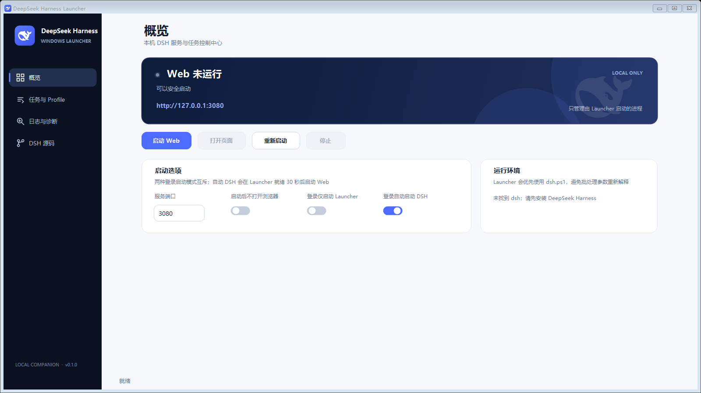
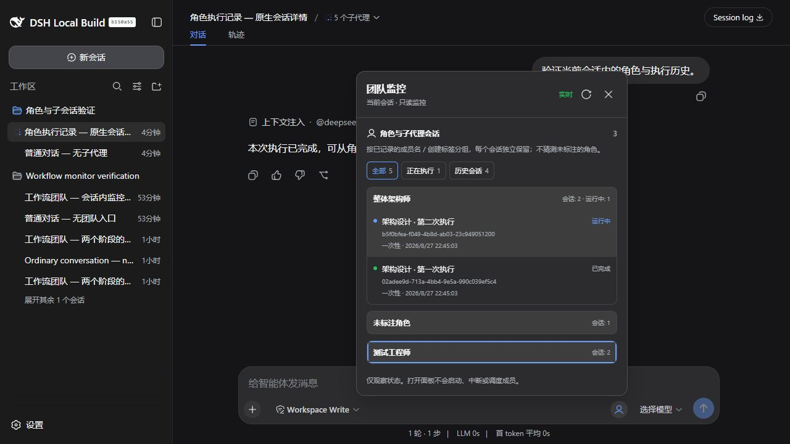

# dsh-enhanced-plugins

中文 | [English](README.md)

面向 [DeepSeek Harness（DSH）](https://github.com/deepseek-ai/deepseek-harness) 的增强功能套件：**7 个可独立安装的 Cordis bundle + 1 个 Windows Companion**。

- 不修改 DSH 核心，只使用公开插件扩展点。
- 可一次安装全部功能，也可只保留选中的独立功能。
- Host、Web Client 与 Windows Companion 各自保持清晰的生命周期和安全边界。

[功能一览](#功能一览) · [快速开始](#快速开始) · [功能指南](#功能指南) · [兼容性与迁移](#兼容性与迁移) · [配置参考](#配置参考) · [开发与验证](#开发与验证)

## 功能一览

安装脚本只需要“安装名称”；每项功能也都有自包含的独立发布包。

| 功能 | 安装名称 | 独立包 | 平台与入口 | 解决什么问题 |
| --- | --- | --- | --- | --- |
| [Windows Launcher](#1-windows-launcher) | `windows-launcher` | `dsh-enhanced-windows-launcher` | Windows 开始菜单 | 用托盘控制 Web、Headless、Profile、源码构建与诊断 |
| [桌面提示与宠物](#2-桌面提示与宠物) | `notification` | `dsh-enhanced-notification` | Windows；设置 → 桌面宠物 | 任务提示音、自定义 WAV 音效库和原生动态桌宠 |
| [插件社区](#3-插件社区) | `plugin-market` | `dsh-enhanced-plugin-market` | Web；设置 → 插件社区 | 搜索、安全预检、安装和卸载社区插件 |
| [MCP 服务器管理](#4-mcp-服务器管理) | `mcp-server-manager` | `dsh-enhanced-mcp-server-manager` | Web；设置 → 插件 | 管理 stdio / Streamable HTTP MCP 服务器并导入本机配置 |
| [pi-ai 模型请求类型](#5-pi-ai-模型请求类型) | `model-input-types` | `dsh-enhanced-model-input-types` | Web；设置 → 插件 | 声明模型接受纯文本还是图片请求 |
| [编辑上一条消息](#6-编辑上一条消息) | `edit-last-message` | `dsh-enhanced-edit-last-message` | Web；最后一条用户消息 | 修改该轮内容并在当前会话重新生成 |
| [产品子智能体](#7-产品子智能体) | `sub-agent` | `dsh-enhanced-sub-agent` | Web；设置 → 子智能体 | 实时启用或停用 Claude Code / Codex 工具 |
| [官方团队监控](#8-官方团队监控) | `agent-team-monitor` | `dsh-enhanced-agent-team-monitor` | Web；当前对话输入框右侧团队图标 | 按角色查看执行中／历史子会话，跳转原生详情，以及 Team 任务依赖和邮箱计数 |

聚合包名为 `dsh-enhanced-plugins`。省略功能选择时，安装脚本会组合上表全部 8 项；选择功能时只安装对应独立包或 Companion。

## 快速开始

### 前置条件

- Node.js 22.19.x，或 Node.js 24 及更高版本。
- 可从源码运行的最新 DSH Web profile；可先阅读 [DSH Web UI 入门](https://deepseek-harness.github.io/deepseek-harness/guide/quickstart)。
- 本仓库针对 DSH [`0.1.1-rc.2`](https://github.com/deepseek-ai/deepseek-harness/tree/b150a551b8d465e31e418e1b2eaf5e79bbb7d28e) 验证，本地 ABI 基准 commit 为 `b150a551b8d465e31e418e1b2eaf5e79bbb7d28e`。
- Windows Launcher、原生提示音和桌面宠物需要带 Windows PowerShell 5.1 的完整 Windows 桌面版本，即 Windows 10 1607 或更高版本，或 Windows 11。所需系统能力在 Home、Pro、Education / Pro Education 与 Enterprise 上相同；Windows S 模式、IoT / 精简版本以及 Windows 10 1507、1511 不在这一基线内。已经超出微软生命周期的 Windows 功能更新只能尽力兼容，因为所需 Node.js 工具链不保证支持已停止维护的操作系统。安装器不依赖某一个特定的 `tar.exe`；其余功能可跨平台使用。

> [!IMPORTANT]
> DSH 仍处于开发者预览阶段。升级 DSH 后若出现兼容问题，请先核对上面的实测版本和 commit。

> [!CAUTION]
> **先确认 DSH 与插件仓库的目录关系，再复制安装命令：**
>
> - **同目录安装：** 两个仓库位于**同一父目录**，直接使用下方命令。
> - **非同目录安装：** 两个仓库位于**不同父目录**，命令必须额外传入 `-DshCheckout "DSH 源码绝对路径"`。

### 安装全部功能

当两个仓库位于同一父目录时，在本仓库根目录运行：

```text
<工作目录>/
├── deepseek-harness/
└── dsh-enhanced-plugins/
```

```powershell
powershell.exe -NoProfile -ExecutionPolicy Bypass -File .\scripts\migrate-to-enhanced-plugin.ps1
```

省略 `-Features` 或传入 `-Features all` 会安装 7 个**独立** Cordis 功能包和必选的 Windows Launcher，不再用根聚合包表示“全选”。Launcher 位于 `%LOCALAPPDATA%\DeepSeekHarness\Launcher`，默认只创建开始菜单快捷方式；需要桌面快捷方式时添加 `-CreateLauncherDesktopShortcut`。直接运行安装脚本只安装或更新程序文件，不会自动启动或打开 Launcher；从 Launcher 内执行自更新时仍会完成必要的版本重启和就绪检查。

如果 DSH checkout 不在同级目录，显式指定它：

```powershell
powershell.exe -NoProfile -ExecutionPolicy Bypass -File .\scripts\migrate-to-enhanced-plugin.ps1 `
  -DshCheckout "E:\projects\deepseek-harness"
```

### 按需安装

先查看当前版本提供的稳定安装名称：

```powershell
powershell.exe -NoProfile -ExecutionPolicy Bypass -File .\scripts\migrate-to-enhanced-plugin.ps1 -ListFeatures
```

再传入最终希望保留的功能集合。例如，只安装桌面提示、MCP 管理和编辑消息：

```powershell
powershell.exe -NoProfile -ExecutionPolicy Bypass -File .\scripts\migrate-to-enhanced-plugin.ps1 `
  -Features notification,mcp-server-manager,edit-last-message
```

常见组合可直接替换命令中的 `-Features` 值：

| 目标 | 功能集合 |
| --- | --- |
| Windows 桌面体验 | `windows-launcher,notification` |
| Agent 与模型增强 | `mcp-server-manager,model-input-types,edit-last-message,sub-agent` |
| 插件发现与集成管理 | `plugin-market,mcp-server-manager` |

`-Features` 不是“额外添加列表”，而是目标 Profile **最终保留的本项目功能集合**。Windows Launcher 是全局必选组件，不需要写入列表，也不能通过功能选择卸载；`-Features none` 只清空当前 Profile 中本项目的功能包并保留 Launcher。脚本会：

1. 安装依赖并构建全部所选功能。
2. 安装并验证所选 bundle / Companion 能否加载。
3. 成功后再移除聚合包、未选择的同仓库功能和已声明冲突的旧包。
4. 检测并清理已经退役的文件引用插件。

### Launcher 插件管理

安装脚本会把 DSH checkout、本项目源码路径、Git remote/ref、源码 revision 和每个已管理 Profile 的目标集合写入 `%LOCALAPPDATA%\DeepSeekHarness\Launcher\install-state.json`。控制中心的“插件管理”页据此提供：

- 从各 `packages/*/package.json` 动态生成的功能列表，新增普通功能无需修改 Launcher；
- 首次默认全选、按 Profile 选择、单项安装/卸载、历史聚合包迁移；
- Git 工作区先执行带退避重试的安全 `fetch`，连接重置时自动改用 HTTP/1.1 重试，成功后仅在本地执行 `merge --ff-only`，避免 `pull` 再次访问网络；或没有 Git 时下载准确 commit 的源码 ZIP；无网络时也可手动绑定源码目录或导入源码 ZIP；
- 只有源码 revision 或目标功能发生变化时，才在 `sources/runtime-*` 持久化隔离快照中执行 `npm ci`、正式 `npm run build` 和 runtime entry 校验；Profile 始终链接到仍然存在的活动快照，未被任何 Profile 引用的旧快照会安全清理；开发期的全仓类型检查仍在源码目录运行，不会因 sibling DSH 类型路径阻止安装；npm 的 stderr 警告保留在日志中，是否失败只看真实退出码；全部完成后才停止 Launcher-owned DSH 并提交更改；
- Launcher 哈希变化时由外部协调器切换版本、等待新版就绪、失败回滚，并恢复此前运行的 DSH；DSH 连续保持 Launcher-owned 状态 15 秒后才报告恢复成功；
- Launcher 重启后继续跟踪仍在运行的协调器；异常中断或状态文件损坏时保留日志/备份并从实际 Profile inventory 重新读取状态。

第一版只支持本地 DSH 源码 checkout 和本项目源码安装，不支持 npx、全局 `dsh`、npm 发布包或 GitHub Releases。Git 工作区有修改、本地领先或发生分叉时不会 reset、rebase 或覆盖用户改动。

任何前置步骤失败时，脚本都不会提前破坏原有可用组合。安装成功后如果 DSH 正在运行，重启当前 Web profile 一次。

## 功能指南

### 1. Windows Launcher

`windows-launcher` · **开始菜单 → DeepSeek Harness Launcher** · Windows 10+



独立于 Cordis 插件树的 Windows 控制中心，适合不想长期守着终端的本地 DSH 用户。

- **Web 控制：** 查看状态，启动、打开、重启或停止 Web；识别外部端口服务并拒绝越权接管。
- **任务与 Profile：** 运行 Headless 单次任务和后台 Profile，统一保存 UTF-8 结果与日志。
- **源码维护：** 对绑定的 DSH checkout 执行 `git pull --ff-only`，成功后再运行 `pnpm run build`；无 Git 时可明确选择仅构建。
- **诊断：** 汇总命令、端口、工作目录、运行状态和日志，并提供独立的 DSH 源码页。
- **桌面体验：** 系统托盘、可选登录启动、各尺寸统一的居中纵向布局、逐显示器 DPI 缩放，以及不受 Windows 主题影响的统一圆角页面与文本区域滚动条；日志与诊断、任务输入/输出、源码构建日志和插件运行日志均使用相同样式，并支持滚轮、触控板、拖动、轨道翻页与键盘滚动。Launcher 会记住最后使用的显示器和正常窗口位置，显示器拓扑或工作区变化后会自动收回可见区域。

<details>
<summary><strong>进程所有权、退出与后台行为</strong></summary>

Launcher 只停止自己启动的 DSH 进程树。端口上出现外部 Web 服务时会显示“外部 Web 服务”，允许打开页面，但不会接管、重启或终止它。

系统托盘提供两个退出动作：“仅退出 Launcher”会保留 DSH 服务；“退出 Launcher”会先请求安全停止 Launcher 自己管理的服务。若检测到外部服务或停止超时，退出会被取消并说明原因。

任务与 Profile 均通过无控制台窗口的子进程运行。用户任务经 UTF-8 请求文件传给 PowerShell 命令引擎，不会拼接进 `cmd.exe`；隐藏主窗口后会停止前台轮询，但托盘和后台服务仍继续工作。

</details>

<details>
<summary><strong>登录启动、部署与源码绑定</strong></summary>

登录启动默认关闭。可选择“只启动 Launcher 到托盘”或“先启动 Launcher，等待 30 秒后再在后台启动 DSH Web”，两种模式互斥，也可以全部关闭。

程序使用版本化目录部署，开始菜单和登录启动项在升级后都会指向新版本，不依赖 profile 内的 `node_modules`。安装器保留用户显式配置的 DSH 命令；使用本地 DSH checkout 安装时，则生成并验证直接调用该 checkout CLI 的安全入口，并将它记录为唯一允许执行源码构建的根目录。

设置、运行状态、安装状态、更新请求与日志统一位于 `%LOCALAPPDATA%\DeepSeekHarness\Launcher`。Launcher 在管理页中始终必选；控制中心不提供自卸载按钮，需要移除程序文件、快捷方式和登录启动项时，在项目源码中运行 `migrate-to-enhanced-plugin.ps1 -UninstallLauncher`。日志与用户设置默认保留。

</details>

### 2. 桌面提示与宠物

`notification` · **设置 → 桌面宠物** · 提示音与宠物仅支持 Windows 10+


- “需要确认”“任务完成”“任务受阻”三类事件可分别关闭，或选择两档默认音 / 自定义 WAV。
- 切换音效会自动试听，也可手动试听；共享增益为 0–100%，100% 约为 +6 dB，并对接近峰值的 PCM / IEEE Float WAV 软限幅。
- 单文件最多 2 MiB，公共音效库最多 64 个文件，全部保存在当前 DSH profile 中。
- 桌宠可选“平面小鲸”“立体小鲸”或“鲸鱼娘”，设置实时生效。

| 汇总状态 | 桌宠表现 |
| --- | --- |
| 空闲 | 睡眠循环；鼠标接触或拖动时切换为互动动作，可选择空闲时不置顶 |
| 任务中 | 专注游动或操作任务面板 |
| 需要确认 | 惊讶、转头或问号提醒，优先级最高 |
| 已完成 | 仅为顶层任务短暂播放庆祝动作 |
| 任务受阻 | 仅为顶层任务短暂播放疲惫或担心动作 |

桌宠可跨显示器拖动，并按显示器保存归一化位置；分辨率、缩放、工作区或显示器连接变化后会重新换算到可见区域。修改启动角落会清除拖动记录。桌宠不会出现在任务栏或 Alt+Tab 任务切换器中；需要隐藏时请在设置中关闭桌宠。Windows 开启“减弱动画”后，每种状态会使用代表静态帧。

常驻宠物和短生命周期提示音进程都由 DSH subprocess service 管理，关闭功能时会协作式退出。若旧配置保存了已经退役的已知桌宠 ID，下次启动会迁移为“平面小鲸”；其他未知值仍会校验失败。

### 3. 插件社区

`plugin-market` · **设置 → 插件社区**


1. 首次打开使用内置快照；“同步最新索引”通过 ETag 获取 GitHub Actions 每 6 小时发布的校验快照，短暂的 429/502/503/504 会自动重试。
2. 可按仓库名、包名、描述或 topic 搜索；安装前先实时预检仓库身份、commit 和发布结构。
3. 只有身份匹配且不含安装生命周期脚本的 npm bundle 才提供“一键安装”。可验证的无构建源码 bundle 可在确认后固定 commit 安装；其他情况只显示安装说明。
4. 安装与卸载作为可取消后台任务执行；完成后验证目标 profile、bundle patch 和组合，失败自动回滚。
5. “已安装”页会区分市场管理的插件和外部管理的插件；只有前者可以从此页卸载。

<details>
<summary><strong>索引发布、网络代理与凭据</strong></summary>

索引由 [`.github/workflows/update-plugin-index.yml`](.github/workflows/update-plugin-index.yml) 生成到 `market-index` 分支：完整枚举 topic，只重新验证新增或变化的仓库；异常缩水或生成失败不会覆盖上次结果。插件市场自身是内置的已验证渠道贡献，即使远程镜像尚未收录也会出现，后续不会重复。

内置快照和自动索引同步都不需要 GitHub Token。Host 会识别 `HTTP_PROXY`、`HTTPS_PROXY`、`ALL_PROXY` 与 `NO_PROXY`（包括小写变量）。安装预检若遇到 GitHub API 限流，可在“配置”中保存只读、短有效期的 Fine-grained Token；Token 只发送到本机 DSH Host，并由 credentials 服务保存。

页面会显示索引生成时间；超过 24 小时未更新时明确提示，同时继续保留上次可用快照。

</details>

### 4. MCP 服务器管理

`mcp-server-manager` · **设置 → 插件 → 插件配置 → MCP 服务器**


1. 添加唯一名称，选择 `stdio` 或 Streamable HTTP。
2. `stdio` 配置命令、参数、工作目录和环境变量；HTTP 配置 HTTP(S) URL 与请求头。
3. 也可由 Host 一键导入本机 Claude Code 与 Codex 配置；重复项会跳过，无法安全转换的项目会说明原因。
4. 检查卡片顶部的格式审计后保存；Host 按服务器分别启动、更新或卸载连接。

浏览器读取已有服务器时会掩码环境变量与请求头；未修改的机密不会从脱敏快照重建或覆盖。

### 5. pi-ai 模型请求类型

`model-input-types` · **设置 → 插件 → 插件配置 → pi-ai 模型请求类型**


先在 DSH“模型”页或 `settings.yaml` 中添加 pi-ai 模型覆盖，再为每个模型选择“提供方默认”“仅文本”或“文本与图片”；选择会立即保存。

只有官方 `llm-pi-ai` settings namespace 可用时才显示此卡片。它保存的是能力声明，不会探测实际端点；声明“文本与图片”前请确认提供方确实接受图片请求。

### 6. 编辑上一条消息

`edit-last-message` · **当前会话最后一条可编辑的用户消息气泡**


1. 等待当前会话结束，或先停止正在运行的会话。
2. 点击“编辑上一条消息”，在气泡内修改文本。
3. 点击“重新发送”或按 `Ctrl/⌘ + Enter`；按 `Esc` 或“取消”退出编辑。

重新发送仍在当前会话内完成：插件从被编辑的用户消息开始替换当前模型上下文，再通过同一个 AgentLoop 生成后续内容。DSH Session 日志保持追加式审计记录，已经执行的工具副作用不会回滚。包含图片或其他非文本块的消息不会提供编辑入口，以免静默丢失内容。

### 7. 产品子智能体

`sub-agent` · **设置 → 子智能体**


打开 Claude Code 或 Codex 后，变更会立即应用到加载了本控制插件的 Agent preset，包括正在运行的会话；关闭开关会实时移除对应工具。本机仍需安装对应产品及其官方 DSH provider。

两个开关默认关闭。写入使用 path-addressed 操作和设置修订号，不会用脱敏或过期快照覆盖其他页面及外部编辑产生的新值。

### 8. 官方团队监控

`agent-team-monitor` · **当前对话输入框右侧 → 团队图标**



- 入口属于当前会话，在输入框右侧的模型／上下文控件同组显示。检测到工作流、Agent Teams 或原生子代理会话后才出现团队图标；点击才展开，切换会话立即关闭并清除旧数据，不注册全局浮层或标题栏按钮。没有子代理／团队活动的普通对话不显示入口。
- “角色与子代理会话”按已记录的成员名／创建标签分组，同名角色的多次创建保留为不同会话；没有标签时单列“未标注角色”，不从提示词或会话标题猜测身份。可筛选“全部／正在执行／历史会话”，查看会话标题、ID、模式、创建时间和状态。目录包含当前会话下的子代理及更深层子会话，不跨到其他会话树。
- 点击可用会话行，会按真实父子 ID 和原生目录模式调用 DSH 的 `openSubagent`，进入与原生下拉列表相同的详情页面。历史、正在执行、嵌套会话均可跳转；点击前重新核对目录，切换会话或插件卸载后不执行迟到跳转。损坏／缺失的记录显示不可用，不伪造空会话。
- 标准 `workflow` 与实验性 Agent Teams 是两套机制，分别展示，不再把“Agent Teams 未启用”误当成没有工作流成员。工作流从当前会话自己的 `tool-workflow/*` 持久事件读取运行名称、实际启动的成员、阶段及完成／失败／取消状态；不会推测脚本未来的角色、任务依赖或邮箱。成员按 `runId + seq` 配对，fork 继承的父会话工作流不会串入新会话。
- Agent Teams 面板跟随当前队长或 roster 成员会话，显示成员状态、任务依赖/负责人/可领取状态、写入范围重叠提示和待投递消息数量。点击任务查看详情，点击成员打开官方子代理会话。
- Host 读取官方 `ctx.agentTeams`，通过官方公开导出的 `foldTeam` 回放 Lead Session。冷历史使用不提交恢复的 `sessionPersistence.inspect()`，不激活 Agent，也不创建 `.agent-teams` 目录或第二份团队状态。
- 只轮询当前会话（展开时 1.5 秒、收起时 5 秒）；隐藏页面或断线后暂停。后续启动的成员和状态变化会自动刷新，但不会自动打开面板。点击图标、外部区域或 Escape 可收起。切换会话、重连和请求失败不会把旧数据显示为实时状态。
- 监控插件**不会启用 Agent Teams 或 workflow**，不注册模型工具，不创建/唤醒/中断成员，不编辑任务或调度工作。查看标准工作流无需实验性 Team 包；要使用 Agent Teams，请按[官方 Team 文档](https://github.com/deepseek-ai/deepseek-harness/tree/dsh-v0.1.1-rc.2/packages/experimental/agent-team)单独启用实验性运行时。
- 基于 DSH `0.1.1-rc.2` 源码 ABI 验证。私有实验包通过当前 profile 的公开包入口解析，不打包副本，也不从 npm 获取；历史回放仍需能解析该包。成员运行状态不等于任务完成状态：“未驻留”不是“已完成”，任务状态仍依赖模型更新。监控不向浏览器传输邮箱正文或 provider 错误原文。最多显示 256 个成员 / 1,000 个任务，超限时明确提示，汇总仍包含全部记录。
- 工作流最多显示 100 次运行、合计 256 条成员记录，汇总保持完整。未记录结束的冷历史不会冒充实时运行；原步骤或轮次已关闭时标记中断。监控只读取公开记录，不读取／执行工作流脚本，普通子代理不会被伪装成实验性 Team。
- 原生子会话目录来自公开的 `subagents.listDescendants`，通过非写入的 `sessionPersistence.inspect()` 获取自身标题与轮次结果。实际 Agent 的运行／空闲状态优先，不能用“仍驻留”冒充“正在执行”。历史筛选包含当前未运行的会话，不表示全部成功。目录最多展示 256 条、优先运行中的 Agent；超限时显示已展示／总数，筛选计数只针对已展示条目。目录不可用不会影响已有 Team／工作流记录的查看。

仅安装该 Profile 功能可使用 `-Features agent-team-monitor`，`-ListFeatures` 可列出所有选择；Windows Launcher 必选规则不变。浅色、深色、跟随系统和中英文均随 DSH 设置变化。

## 兼容性与迁移

- **实测基线：** DSH `0.1.1-rc.2`，commit `b150a551b8d465e31e418e1b2eaf5e79bbb7d28e`。
- **架构边界：** Web 功能通过公开 Service、event、slot 和 settings 扩展；Windows Launcher 是独立 Companion，不进入 Cordis 插件树。
- **文件引用已退役：** 最新官方 DSH 已原生支持 [`@` 文件引用](https://github.com/deepseek-ai/deepseek-harness/tree/master/packages/context/file-reference)。在输入框键入 `@`，含空格路径可键入 `@"`。旧 `referenced-file` 安装名称和 `#` 快照语法不再提供。
- **自动清理：** `-Features referenced-file` 会被明确拒绝；正常运行安装脚本会清理历史独立包或旧版聚合包中携带的该功能。

## 配置参考

默认组合位于 [`cordis.patch.yml`](cordis.patch.yml)。后应用的 profile patch 会整体替换目标 Loader 行的 `config`，因此覆盖时必须重述该行需要保留的全部字段。

<details>
<summary><strong>桌面提示默认配置</strong></summary>

| 字段 | 默认值 | 用途 |
| --- | --- | --- |
| `completionSound` | `subtle` | 任务完成提示音：`off`、`subtle`、`prominent` 或上传的 `custom` |
| `confirmationSound` | `prominent` | 需要关注提示音：`off`、`subtle`、`prominent` 或上传的 `custom` |
| `blockedSound` | `prominent` | 任务受阻提示音：`off`、`subtle`、`prominent` 或上传的 `custom` |
| `soundGain` | `0` | 默认音和自定义音共用的 0–100% 正向增益；100 约为 +6 dB |
| `petEnabled` | `false` | 是否显示原生全局桌面宠物 |
| `petCharacter` | `classic` | `classic`（平面小鲸）、`multiview`（立体小鲸）或 `whale-girl`（鲸鱼娘） |
| `petIdleTopmost` | `true` | 空闲状态是否仍保持置顶 |
| `petSize` | `112` | `80`、`112`、`144` 或 `176` 设备无关像素 |
| `petPosition` | `bottom-right` | `top-left`、`top-right`、`bottom-left` 或 `bottom-right` |

六个 `*CustomSoundFile` / `*CustomSoundName` 字段由 Host 管理三类提示音的选择引用。共享目录保存在 profile 内的 `desktop-notifications/sound-library.json`；请通过设置页面上传和选择自定义音，不要手工编辑这些字段。

</details>

<details>
<summary><strong>插件社区 Host 配置</strong></summary>

| 字段 | 默认值 | 作用 |
| --- | --- | --- |
| `profile` | `web` | 安装和卸载目标 profile |
| `topic` | `dsh-plugin` | 已校验渠道文档必须匹配的 topic |
| `channelUrl` | `market-index` 分支 HTTPS 快照 | “同步最新索引”使用的发布地址 |
| `pageSize` | `12` | 每页插件数 |
| `operationTimeoutMs` | `120000` | 安装和卸载超时 |
| `githubTokenEnv` | `GITHUB_TOKEN` | credentials 引用名 |
| `cliPath` | 空 | 可选 DSH 可执行文件绝对路径 |

内置 [`assets/plugins-cache.json`](assets/plugins-cache.json) 是只读引导快照，也是自动索引首次运行的增量校验种子。缓存、ETag、后台任务和安装记录由 Host 管理并保存到 DSH home。插件社区不会解析 README 中的 shell 命令，也不会启用 `dangerouslyAllowAllBuilds`。

</details>

若只想让部分 Agent preset 获得产品子智能体工具，请禁用或移除根层 `subagent-product-toggle-tools` 行，再只在目标 preset 中挂载对应入口：

- 聚合包：`dsh-enhanced-plugins/sub-agent/preset`
- 独立包：`dsh-enhanced-sub-agent/preset`

同一 scope 不要同时挂载两种布局。

## 开发与验证

本仓库以只读 sibling checkout 作为 DSH API、类型和真实 Web 组装基准：

```text
D:\work\workspace\github\deepseek-harness
```

常规验证命令：

```powershell
npm install
npm run typecheck
npm test
npm run build
npm run pack:dry-run
git diff --check
```

浏览器 bundle 使用 CSS Modules，并且只消费 DSH 的 `--dsw-alias-*` 语义主题 token，会自动跟随 light、dark 与 system 外观。插件架构与公开扩展点可参考 [DSH 插件开发文档](https://deepseek-harness.github.io/deepseek-harness/develop/basic/) 和 [架构参考](https://deepseek-harness.github.io/deepseek-harness/reference/)。

## License

[MIT](LICENSE)
