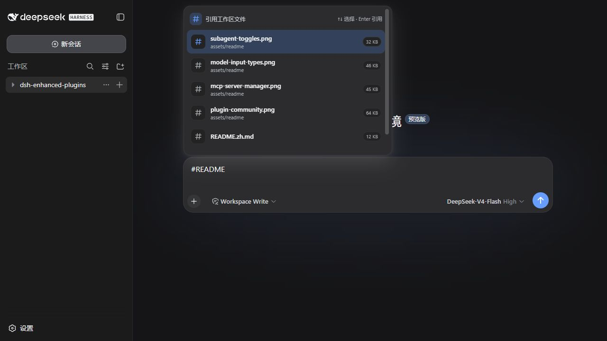

# dsh-enhanced-plugins

[English](README.md) | 中文

`dsh-enhanced-plugins` 是面向 [DeepSeek Harness（DSH）](https://github.com/deepseek-ai/deepseek-harness) Web profile 的增强插件集合。一次安装可获得全部 7 项功能，也可以只保留需要的独立 bundle。

项目只使用 DSH 的公开插件扩展点，不修改 DSH 核心。各功能分别管理自己的 Host、Client、Settings 和运行时生命周期，可独立构建、安装和卸载。

[功能一览](#功能一览) · [快速安装](#快速安装) · [功能指南](#功能指南) · [配置参考](#配置参考) · [开发与验证](#开发与验证)

## 功能一览

“安装名称”用于安装脚本的 `-Features` 参数，也是按需安装时唯一需要记住的标识。

| 功能 | 安装名称 | 使用位置 | 主要用途 |
| --- | --- | --- | --- |
| [桌面提示与宠物](#桌面提示与宠物) | `notification` | 设置 → 桌面宠物 | 任务提示音、自定义 WAV 音效库与原生动态 DeepSeek 鱼宠物 |
| [插件社区](#插件社区) | `plugin-market` | 设置 → 插件社区 | 搜索、安装和卸载社区 DSH 插件 |
| [MCP 服务器管理](#mcp-服务器管理) | `mcp-server-manager` | 设置 → 插件 → 插件配置 | 管理 stdio / Streamable HTTP MCP 服务器并导入本机配置 |
| [pi-ai 模型请求类型](#pi-ai-模型请求类型) | `model-input-types` | 设置 → 插件 → 插件配置 | 声明模型接受纯文本还是图片请求 |
| [工作区文件引用](#工作区文件引用) | `referenced-file` | 会话输入框中输入 `#` | 搜索工作区文件并把安全的文本快照加入下一次请求 |
| [编辑上一条消息](#编辑上一条消息) | `edit-last-message` | 最后一条用户消息气泡 | 修改该轮内容并在当前会话重新生成 |
| [产品子智能体](#产品子智能体) | `sub-agent` | 设置 → 子智能体 | 实时启用或停用 Claude Code / Codex 工具 |

## 快速安装

### 开始前

- Node.js 22.19 或更高版本。
- DSH Web profile。本仓库针对 DSH `0.1.0-rc.5` 的公开 ABI 验证，本地基准 commit 为 `47f943859bef60e4160492346772ded9b24f765a`。
- 原生提示音和桌面宠物需要 Windows 10 或更高版本及 Windows PowerShell 5.1；其余功能可跨平台使用。

DSH 仍处于开发者预览阶段并可能产生不兼容变更。升级 DSH 后若遇到问题，请先核对上述 ABI 版本。

> [!CAUTION]
> **先确认 DSH 与插件仓库的目录关系，再复制安装命令：**
>
> - **同目录安装：** 两个仓库位于**同一父目录**，直接使用下方命令。
> - **非同目录安装：** 两个仓库位于**不同父目录**，命令必须额外传入 `-DshCheckout "DSH 源码绝对路径"`。

### 安装全部功能

**同目录安装**：当 `deepseek-harness` 与本仓库位于同一父目录时，在本仓库根目录运行：

```text
<工作目录>/
├── deepseek-harness/
└── dsh-enhanced-plugins/
```

```powershell
powershell.exe -NoProfile -ExecutionPolicy Bypass -File .\scripts\migrate-to-enhanced-plugin.ps1
```

省略 `-Features` 或传入 `-Features all` 都会安装聚合包。

### 按需安装

先列出当前版本提供的功能：

```powershell
powershell.exe -NoProfile -ExecutionPolicy Bypass -File .\scripts\migrate-to-enhanced-plugin.ps1 -ListFeatures
```

再用逗号分隔“功能一览”中的安装名称，例如只保留桌面提示、MCP 管理和文件引用：

```powershell
powershell.exe -NoProfile -ExecutionPolicy Bypass -File .\scripts\migrate-to-enhanced-plugin.ps1 -Features notification,mcp-server-manager,referenced-file
```

`-Features` 表示目标 profile **最终保留的增强功能集合**。脚本会先成功构建并安装全部所选 bundle，再移除聚合包、未选择的同仓库 bundle，以及与所选功能冲突的旧包；安装失败时不会提前破坏原有可用组合。

**非同目录安装**：如果 DSH checkout 不在同级目录，通过 `-DshCheckout` 指定位置：

```powershell
powershell.exe -NoProfile -ExecutionPolicy Bypass -File .\scripts\migrate-to-enhanced-plugin.ps1 -DshCheckout "E:\projects\deepseek-harness"
```

安装脚本会完成依赖安装、构建、`web` profile 安装与加载验证。成功后若 DSH 正在运行，重启一次即可使用。

## 功能指南

### 桌面提示与宠物

安装名称：`notification` · 位置：**设置 → 桌面宠物**


提示音支持“需要确认”“任务完成”“任务受阻”三类事件。每类可分别选择关闭、两档内置默认音或公共音效库中的自定义 WAV；切换选项会自动试听，也可手动点击“试听”。共享增益范围为 0–100%，100% 约为 +6 dB，并对接近峰值的 PCM / IEEE Float WAV 软限幅。单文件最多 2 MiB，音效库最多 64 个文件，全部保存在当前 DSH profile 中。

打开“启用桌面宠物”后，浏览器之外会显示原生 DeepSeek 鱼。它会根据所有会话汇总为以下状态：

- **空闲**：漂浮、呼吸并随机待机；可选择空闲时不置顶。
- **任务中**：游动、吐泡泡并显示进度环。
- **需要确认**：跳动、摇晃、脉冲并显示感叹号，优先级最高。
- **已完成 / 任务受阻**：顶层任务结束后的短暂反馈；子智能体结束不会重复提示。

宠物可跨显示器自由拖动，拖动过程中允许越过桌面边缘；松开鼠标后，会优先完整吸附到重叠面积最大的显示器工作区，若停在显示器之间的空隙，则吸附到边缘距离最近的显示器。插件会按显示器保存归一化位置，并在分辨率、缩放、工作区或显示器连接状态变化后重新换算到可见区域。修改“启动位置”会清除拖动记录并恢复到所选角落。Windows 开启“减弱动画”后会自动使用静态状态帧。

设置实时生效。常驻宠物及短生命周期提示音进程均由 DSH subprocess service 管理；关闭功能时会协作式退出，不遗留 helper 进程。

### 插件社区

安装名称：`plugin-market` · 位置：**设置 → 插件社区**


1. 首次打开使用内置插件快照；需要最新社区数据时点击“同步渠道”。
2. 按仓库名、包名、描述或 topic 搜索，安装前可打开 GitHub 仓库核对来源。
3. 在“已安装”标签页查看或卸载由插件社区安装的项目。
4. 安装或卸载后，按页面提示重启当前 Web profile。

未配置 GitHub Token 也能使用内置快照。若同步触发 GitHub API 限流，可在“配置”中保存只读、短有效期的 Fine-grained Token；Token 只发送到本机 DSH Host，并由 credentials 服务保存。

### MCP 服务器管理

安装名称：`mcp-server-manager` · 位置：**设置 → 插件 → 插件配置 → MCP 服务器**


1. 点击“添加服务器”，填写唯一名称并选择 `stdio` 或 Streamable HTTP。
2. `stdio` 配置命令、参数、工作目录和环境变量；HTTP 配置 HTTP(S) URL 与请求头。
3. 也可以“一键导入 Claude Code 与 Codex”，由 Host 读取本机已有配置；重复项会跳过，无法安全转换的项目会说明原因。
4. 检查卡片顶部的格式审计结果后保存。Host 会按服务器分别启动、更新或卸载连接。

浏览器读取已有服务器时会掩码环境变量和请求头的值；未修改的机密不会从脱敏快照重建或覆盖。

### pi-ai 模型请求类型

安装名称：`model-input-types` · 位置：**设置 → 插件 → 插件配置 → pi-ai 模型请求类型**


先在 DSH“模型”页或 `settings.yaml` 中添加 pi-ai 模型覆盖，再为每个模型选择“提供方默认”“仅文本”或“文本与图片”。选择会立即保存。

只有官方 `llm-pi-ai` settings namespace 可用时才显示此卡片。这里保存的是能力声明，不会探测实际端点；声明“文本与图片”前请确认提供方确实接受图片请求。

### 工作区文件引用

安装名称：`referenced-file` · 位置：**任意已选择工作区的会话输入框**



1. 输入 `#`，继续输入文件名或路径片段缩小候选范围。
2. 使用 `↑` / `↓` 选择并按 `Enter` 插入，也可以直接点击候选。
3. 发送消息时，Host 会重新解析路径、检查工作区边界，并把文件的 UTF-8 文本快照加入本次模型请求。

默认最多引用 8 个文件，单文件 128 KiB、总计 512 KiB。二进制文件、非法 UTF-8、超限文件、非常规文件和工作区外路径会被拒绝。

### 编辑上一条消息

安装名称：`edit-last-message` · 位置：**当前会话最后一条可编辑的用户消息气泡**


1. 等待当前会话结束，或先停止正在运行的会话。
2. 点击“编辑上一条消息”，在气泡内修改文本。
3. 点击“重新发送”或按 `Ctrl/⌘ + Enter`；按 `Esc` 或“取消”退出编辑。

重新发送仍在当前会话内完成：插件从被编辑的用户消息开始替换当前模型上下文，再通过同一个 AgentLoop 生成后续内容。DSH Session 日志保持追加式审计记录，已执行工具的外部副作用不会回滚。包含图片或其他非文本块的消息不提供编辑入口，避免静默丢失内容。

### 产品子智能体

安装名称：`sub-agent` · 位置：**设置 → 子智能体**


打开 Claude Code 或 Codex 后，变更会立即应用到加载了本控制插件的 Agent preset，包括正在运行的会话，无需重启 profile；关闭开关会实时移除对应工具。本机仍需安装对应产品及其官方 DSH provider。

两个开关默认关闭。写入使用 path-addressed 操作和设置修订号，不会用脱敏或过期快照覆盖其他页面及外部编辑产生的新值。

## 配置参考

默认组合位于 [`cordis.patch.yml`](cordis.patch.yml)。后应用的 profile patch 会整体替换目标 Loader 行的 `config`；覆盖时需要重述该行必须保留的全部字段。

<details>
<summary>桌面提示默认配置</summary>

| 字段 | 默认值 | 用途 |
| --- | --- | --- |
| `completionSound` | `subtle` | 任务完成提示音：`off`、`subtle`、`prominent` 或上传的 `custom` |
| `confirmationSound` | `prominent` | 需要关注提示音：`off`、`subtle`、`prominent` 或上传的 `custom` |
| `blockedSound` | `prominent` | 任务受阻提示音：`off`、`subtle`、`prominent` 或上传的 `custom` |
| `soundGain` | `0` | 默认音和自定义音共用的 0–100% 正向增益；100 约为 +6 dB |
| `petEnabled` | `false` | 是否显示原生全局桌面宠物 |
| `petIdleTopmost` | `true` | 空闲状态是否仍保持置顶 |
| `petSize` | `112` | 宠物尺寸：`80`、`112`、`144` 或 `176` 设备无关像素 |
| `petPosition` | `bottom-right` | 回退/重置角落：`top-left`、`top-right`、`bottom-left` 或 `bottom-right` |

六个 `*CustomSoundFile` / `*CustomSoundName` 字段由 Host 管理三类提示音的选择引用。共享目录保存在 profile 内的 `desktop-notifications/sound-library.json`；请通过设置页面上传和选择自定义音，不要手工编辑这些字段。

</details>

<details>
<summary>插件社区 Host 配置</summary>

| 字段 | 默认值 | 作用 |
| --- | --- | --- |
| `profile` | `web` | 安装和卸载的目标 profile |
| `topic` | `dsh-plugin` | GitHub 发现 topic |
| `pageSize` | `12` | 每页插件数 |
| `operationTimeoutMs` | `120000` | 安装和卸载超时 |
| `githubTokenEnv` | `GITHUB_TOKEN` | credentials 引用名 |
| `cliPath` | 空 | 可选 DSH 可执行文件绝对路径 |

内置 [`assets/plugins-cache.json`](assets/plugins-cache.json) 是只读快照；同步缓存和安装记录保存在 DSH home 的插件市场数据目录。

</details>

<details>
<summary>工作区文件引用默认限制</summary>

| 字段 | 默认值 |
| --- | ---: |
| `maxCandidates` | 20 |
| `maxScannedEntries` | 5000 |
| `maxDepth` | 12 |
| `maxReferences` | 8 |
| `maxFileBytes` | 131072 |
| `maxTotalBytes` | 524288 |
| `indexTtlMs` | 30000 |
| `maxCachedWorkspaces` | 8 |

</details>

若只想让部分 Agent preset 获得产品子智能体工具，请禁用或移除根层的 `subagent-product-toggle-tools` 行，并只在目标 preset 中挂载对应入口：聚合包使用 `dsh-enhanced-plugins/sub-agent/preset`，独立包使用 `dsh-enhanced-sub-agent/preset`。同一 scope 不要同时挂载两种布局。

## 开发与验证

仓库使用以下只读 sibling checkout 作为 DSH API、类型和真实 Web 组装基准：

```text
D:\work\workspace\github\deepseek-harness
```

常规验证命令：

```powershell
npm install
npm run typecheck
npm test
npm run build
npm run pack:dry-run
git diff --check
```

浏览器 bundle 使用 CSS Modules，并且只消费 DSH 的 `--dsw-alias-*` 语义主题 token，因此会自动跟随 light、dark 和 system 外观。

## License

[MIT](LICENSE)
